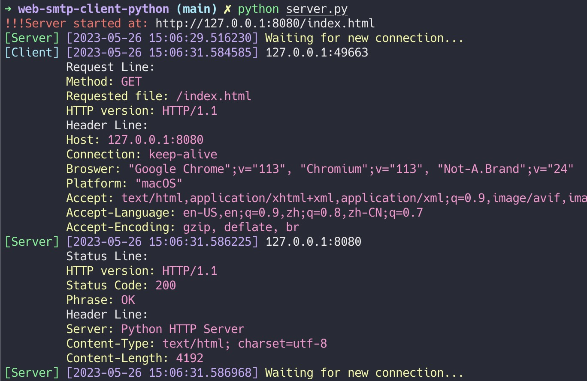

# web-smtp-client-python
A lab work of BUPT course "Computer Networking".


## Highlight

* Beautiful Web pages:


* Beautiful console messages:




## Usage

You can use the default options:

- name = 127.0.0.1
- port = 8080

by:
```bash
$ python server.py
```

Or you can sepecify your server IP and Port by:

```bash
$ python server.py --name 114.514.191.981 --port 11451
```

After running the server, you can open the ***ip+port+index.html*** in your broswer.

Click the Compose New Email button to compose new email.

Here is an example on how to add multiple receivers:


